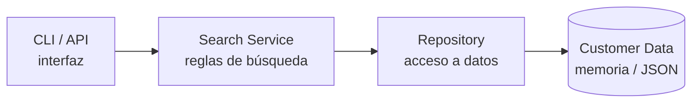

# Architecture 
 
## Overview 
Arquitectura de tres capas, proporcional al alcance de SPEC.md: una interfaz local (CLI o API HTTP local), un servicio que concentra las reglas de búsqueda, y un repositorio que abstrae el acceso a los datos en memoria o JSON. No se introducen colas, cachés ni bases de datos: el volumen (≤ 1 000 clientes) y la ejecución mono-proceso  no lo justifican.



## Components 
- **CLI / API**: punto de entrada local. Recibe la consulta cruda, invoca a Search Service y presenta el resultado (o el mensaje de error) sin aplicar lógica de negocio propia.
- **Search Service**: aplica normalización, coincidencia, orden, truncamiento y proyección de campos. Es el único componente con reglas de negocio.
- **Repository**: expone el catálogo completo de clientes al Search Service, sin conocer reglas de búsqueda.
- **Customer Data**: almacenamiento en memoria o archivo JSON local (C-02).
 
## Responsibilities 
- **CLI / API**: parsear entrada, invocar `SearchService.search`, formatear salida (lista + total, o estado vacío/NO_RESULTS), traducir errores del servicio a la salida del canal (texto en CLI, JSON en API).
- **Search Service**: SR-01 a SR-09 (unión sin duplicados, subcadena, normalización, trim, consulta vacía, truncamiento a 50, orden con desempate, alcance único, proyección de campos), EH-01 y EH-02 (consulta vacía y sin resultados).
- **Repository**: `find_all()` sobre Customer Data; no filtra, no ordena, no normaliza.
- **Customer Data**: persistir y devolver registros crudos; no valida reglas de búsqueda.
 
## Data Flow 
1. El usuario ejecuta un comando (CLI) o envía una petición local (API) con la consulta.
2. La interfaz pasa la consulta cruda a `SearchService.search(query)`.
3. Search Service recorta espacios (SR-04); si el resultado es vacío, aplica EH-01 y retorna sin consultar el Repository.
4. Search Service pide el catálogo completo al Repository (`find_all()`).
5. Search Service normaliza consulta y campos (SR-03), filtra por subcadena (SR-02) en nombre y email, y deduplica por `cliente_id` (SR-01).
6. Search Service ordena (SR-07) y trunca a 50 con total informado (SR-06).
7. Search Service proyecta cada resultado a {cliente_id, nombre, email} (SR-09); si el conjunto es vacío aplica EH-02, poblando `status = "NO_RESULTS"` y `message` con la constante del servicio.
8. La interfaz recibe el resultado y lo presenta al usuario.
 
## Interfaces 
```python
class SearchService:
    def search(self, query: str) -> SearchResult: ...
 
@dataclass
class SearchResult:
    items: list[CustomerView]   # máx. 50, proyectados (FR-10)
    total: int                  # total real de coincidencias (FR-07)
    status: str                 # "OK" | "EMPTY_QUERY" | "NO_RESULTS"
    message: str | None = None  # mensaje fijo; solo poblado en NO_RESULTS (FR-06, EH-02)                 # "OK" | "EMPTY_QUERY" | "NO_RESULTS"
 
@dataclass
class CustomerView:
    cliente_id: str
    nombre: str
    email: str
 
class CustomerRepository:
    def find_all(self) -> list[Customer]: ...

    
```
El repositorio devuelve entidades `Customer` completas; Search Service es responsable de proyectarlas a `CustomerView` antes de devolverlas a la interfaz, de modo que ningún campo fuera de la lista blanca cruce esa frontera.
 
## Error Handling 
Toda la lógica de error vive en Search Service, no en la interfaz:
- Consulta vacía o solo espacios → `status = "EMPTY_QUERY"`, `items = []`, sin invocar al Repository (EH-01).
- Consulta sin coincidencias → `status = "NO_RESULTS"`, `items = []`, mensaje fijo tomado de una constante del servicio (EH-02).
- No hay manejo de errores de autenticación, TLS o rate limiting: no existen esos componentes en esta arquitectura (EH-03, EH-04 de SPEC.md, N/A por C-05).
 
## Testing Strategy 
- **Unit — Search Service**: normalización (diacríticos/case), subcadena en cualquier posición, deduplicación, trim de espacios, consulta vacía, truncamiento a 50 con total correcto, orden y desempate por `cliente_id`, proyección de campos.
- **Unit — Repository**: lectura/escritura contra el backend en memoria o JSON (C-02), incluyendo dataset vacío y dataset en el límite de C-08.
- **Integration — CLI / API**: verificación mínima de que la interfaz invoca al servicio correctamente y traduce cada `status` a su salida esperada.
- **Latencia (NFR-01 / AC-08)**: prueba separada, no unitaria, que ejecuta consultas secuenciales sobre 1 000 clientes y mide p95/p99.
 
## Dependencies 
Librería estándar de Python (`unicodedata` para remover diacríticos, `json` para persistencia) más `pytest` para pruebas (C-01, C-03). Ninguna dependencia de terceros para producción.
 
## Design Decisions 
- La normalización, el orden, el truncamiento y la proyección de campos viven en Search Service, no en el Repository ni en la interfaz: mantiene la lógica de negocio testable de forma aislada, independiente del almacenamiento y de la presentación.
- FR-09 se implementa como "sin filtrado" (Search Service siempre consulta el catálogo completo): es la traducción fiel de su forma degenerada en SPEC.md (A-07, alcance único). El punto de extensión para una autorización real por rol quedaría en Search Service, antes de la proyección, sin tocar Repository ni interfaz.
- La proyección de campos (FR-10) se aplica en Search Service y no en la interfaz, para que la lista blanca se cumpla sin importar cuántas interfaces (CLI, API) consuman el servicio.
 
## Trade-offs
- Consultar siempre el catálogo completo (`find_all()`) es simple y suficiente para ≤ 1 000 clientes (C-08), pero no escala a volúmenes mayores sin introducir indexado — decisión aceptable dado el alcance actual y explícitamente fuera de este incremento.
- Concentrar toda la lógica en Search Service facilita las pruebas unitarias pero lo convierte en un componente más grande; se acepta porque el alcance es una sola feature y no justifica dividirlo en más colaboradores.
- No hay capa de autenticación/autorización real (solo el punto de extensión señalado en Design Decisions): correcto para C-05, pero implica que reactivar FR-09 en su forma completa requerirá revisar Search Service y posiblemente el Repository. 