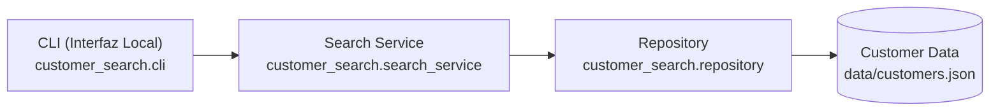

# Customer Search Feature (`ada-05-spec-driven-feature`)

Implementación local de la funcionalidad de búsqueda de clientes por nombre o correo electrónico, desarrollada con arquitectura guiada por especificación (Spec-Driven Development).

---

## 1. Descripción y Arquitectura

El sistema implementa una arquitectura desacoplada de tres capas conforme a [ARCHITECTURE.md](file:///C:/Users/ItzKe/Documents/9no_Semestre/Ingenieria%20asistida%20con%20IA/ada-05-spec-driven-feature/ada-05-spec-driven-feature/ARCHITECTURE.md):



- **CLI (`customer_search.cli`)**: Punto de entrada de línea de comandos. Parsea argumentos de entrada y formatea la salida de resultados y estados (`OK`, `EMPTY_QUERY`, `NO_RESULTS`).
- **Search Service (`customer_search.search_service`)**: Concentra toda la lógica de negocio:
  - Normalización de texto y eliminación de diacríticos (`customer_search.normalization`).
  - Búsqueda simultánea sobre nombre y email con coincidencia por subcadena sin duplicados (FR-01, FR-02).
  - Truncamiento a 50 resultados con reporte del total real (FR-07).
  - Ordenamiento determinista en 3 niveles de coincidencia con desempate alfabético e ID (FR-08).
  - Proyección de resultados a la lista blanca (`CustomerView`: `cliente_id`, `nombre`, `email`) (FR-10).
  - Manejo de consultas vacías y sin resultados con mensajes fijos (FR-05, FR-06).
- **Customer Repository (`customer_search.repository`)**: Abstrae la lectura de los clientes desde almacenamiento JSON (`data/customers.json`) sin aplicar filtros, orden ni normalización.

---

## 2. Instalación

Requiere **Python 3.11+** y `pytest`.

```powershell
# Clonar o ubicarse en la raíz del repositorio
# Instalar el paquete en modo editable
pip install -e .
```

---

## 3. Uso de la Interfaz (CLI)

Ejecutar la interfaz de línea de comandos mediante el módulo `customer_search.cli`:

```powershell
# 1. Búsqueda por coincidencia parcial en nombre
python -m customer_search.cli "carlos"

# 2. Búsqueda insensible a mayúsculas y diacríticos (á, é, í, ó, ú, ü, etc.)
python -m customer_search.cli "JOSÉ"
python -m customer_search.cli "jose"

# 3. Búsqueda por coincidencia en correo electrónico
python -m customer_search.cli "special"

# 4. Búsqueda con espacios al inicio y final (recortados automáticamente)
python -m customer_search.cli "   ana   "

# 5. Consulta vacía o solo espacios (devuelve estado EMPTY_QUERY sin ejecutar búsqueda)
python -m customer_search.cli "   "

# 6. Búsqueda sin coincidencias (devuelve estado NO_RESULTS con mensaje fijo)
python -m customer_search.cli "termino_inexistente"
```

---

## 4. Ejecución de Pruebas

La suite de pruebas automatizadas está construida con `pytest`:

```powershell
# Ejecutar todas las pruebas unitarias y de integración
pytest -v

# Ejecutar únicamente la prueba de latencia con reporte en consola (NFR-01 / AC-08)
pytest tests/test_latency.py -v -s

# Ejecutar pruebas específicas de normalización y servicio
pytest tests/test_normalization.py tests/test_search_service.py -v

# Ejecutar pruebas de la CLI
pytest tests/test_cli.py -v
```


## 6. Checklist de Revisión Humana (Fase 10)

- **¿El código cumple con REQUIREMENTS.md y SPEC.md?**
  **Sí.** Se verificaron todos los requisitos funcionales FR-01 a FR-10 y el requisito no funcional NFR-01 mediante pruebas automatizadas (AC-01 a AC-13). NFR-02 y NFR-03 quedaron explícitamente fuera de alcance según C-05.
- **¿SPEC.md referencia sin redefinir requisitos?**
  **Sí.** SPEC.md toma las definiciones exactas de REQUIREMENTS.md sin alterar su semántica ni inventar nuevos comportamientos.
- **¿Se inventaron reglas de negocio fuera de la especificación?**
  **No.** Todas las reglas implementadas (SR-01 a SR-09, EH-01 y EH-02) provienen de SPEC.md y las decisiones documentadas en REQUIREMENTS.md (Q-01 a Q-16).
- **¿ARCHITECTURE.md coincide con el código implementado?**
  **Sí.** La separación en tres capas (CLI local, SearchService, CustomerRepository y JSON fixture) y las interfaces (`Customer`, `CustomerView`, `SearchResult`, `CustomerRepository`, `SearchService`) coinciden exactamente con la arquitectura diseñada.